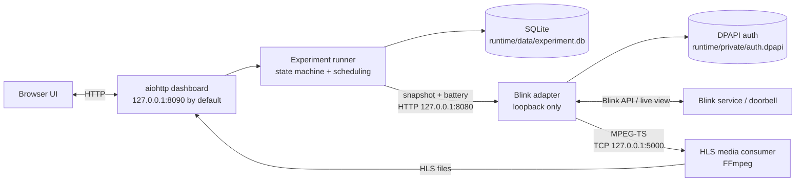

# Blink Battery Experiment Dashboard

> Local, restart-safe tooling for measuring Blink doorbell battery behavior under scheduled snapshots and continuous live view.


> [!WARNING]
> **Pre-release and only partially tested.** The latest revision has not completed full hardware and long-duration validation and **still contains bugs that need to be fixed**. Treat results as experimental rather than production-grade.

> [!CAUTION]
> Use this software at your own risk. It can generate repeated camera activity, consume battery, write local experiment data, and depend on third-party Blink behavior that can change. Do not rely on it for safety, security monitoring, or any use where camera availability is critical.

This project runs a four-stage battery experiment against one Blink doorbell. It schedules three snapshot workloads followed by a continuous live-view workload, records fresh battery readings and operational counters in SQLite, survives application restarts, and presents status, media, history, and errors in a local browser dashboard.

The project is independent and unofficial. It is not affiliated with, endorsed by, or supported by Amazon or Blink.

## 🧩 Architecture



The dashboard is loopback-only by default. The adapter remains loopback-only even when the dashboard is explicitly configured for LAN access. See [Architecture](docs/ARCHITECTURE.md) and [Security](SECURITY.md) for boundaries and caveats.

## Experiment sequence

The committed defaults run:

1. Snapshot every 300 seconds for up to 12 active hours.
2. Snapshot every 60 seconds for up to 12 active hours.
3. Snapshot every 30 seconds for up to 12 active hours.
4. Continuous live view until 12 receipt-confirmed active hours have accumulated.

A 12-hour recovery period separates completed tests. Snapshot-test elapsed time pauses while the application is closed or manually stopped. Stream-test elapsed time advances only between sufficiently close positive stream-byte receipts; startup waits, disconnects, silent stalls, FFmpeg failures, and reconnect gaps do not count as valid stream time.

Battery readings and experiment state are persisted in SQLite. A configured low/replacement battery state stops camera activity and requires a fresh non-low reading before an early continuation.

## 🚀 Getting started

The normal Windows entry point is parameter-free:

```text
launch.cmd
```

On first launch, the launcher creates `.venv`, installs the pinned Python dependencies, downloads and verifies the pinned `blinkliveview` source revision, checks for FFmpeg, then prompts for Blink authentication and camera selection.

Before running it, read:

- [Setup guide](docs/SETUP.md)
- [Hardware and software requirements](docs/REQUIREMENTS.md)
- [Troubleshooting](docs/TROUBLESHOOTING.md)

## 🔒 Security model

- Blink credentials and reusable authentication state are stored in `runtime/private/auth.dpapi` using Windows DPAPI in current-user scope.
- MFA one-time codes are not intentionally persisted.
- `runtime/`, `config.local.toml`, environment files, logs, caches, and local tool state are excluded from Git.
- The Blink adapter HTTP and TCP listeners are loopback-only.
- The dashboard is loopback-only unless `server.allow_lan = true` is explicitly enabled.
- LAN mode uses a random bearer token stored in `runtime/private/dashboard-access.token` and establishes an HTTP-only, SameSite cookie.
- LAN transport is plain HTTP. The bearer controls access; it does **not** encrypt traffic.
- Upstream live-view target details are intentionally suppressed from adapter output.

See [SECURITY.md](SECURITY.md) for reporting and operational guidance.

## Configuration

Committed defaults are in [`config.toml`](config.toml). Put machine-specific overrides in untracked `config.local.toml`; the loader deep-merges the local file over the committed defaults.

For a short development exercise:

```bat
copy config.dev.example.toml config.local.toml
```

Delete `config.local.toml` to return to the committed defaults.

The main groups are `[server]`, `[blink]`, `[experiment]`, `[paths]`, and `[media]`. Invalid ports, unknown keys, non-positive timing values, and an experiment layout other than three snapshot tests followed by one stream test fail fast.

## Local runtime data

The launcher creates mutable data under `runtime/`:

```text
runtime/
  data/
    experiment.db
    latest.jpg
    hls/
  deps/
    blinkliveview/
  logs/
    application.log
    adapter.log
  private/
    auth.dpapi
    dashboard-access.token    # LAN mode only
```

SQLite uses WAL mode. Application logs rotate at 5 MiB with five backups. Experiment database growth is workload-dependent and is not capped by the project.

## HTTP interface

The dashboard exposes:

```text
GET  /healthz
GET  /api/status
GET  /api/measurements?start=<ISO-8601>&limit=<n>
GET  /api/errors?limit=<n>
GET  /latest.jpg
GET  /stream/index.m3u8
POST /api/experiment/start
POST /api/experiment/stop
POST /api/experiment/restart
POST /api/experiment/continue
```

See [API reference](docs/API.md) for authentication, parameters, and stability notes.

## Development and testing

For development from a shell with Python available:

```text
python -m venv .venv
.venv/bin/python -m pip install -r requirements-test.lock
.venv/bin/python -m pytest -q
node --check static/app.js
```

On Windows, use `.venv\Scripts\python.exe` instead of `.venv/bin/python`.

The repository includes unit/integration-style tests for configuration, SQLite migrations, experiment transitions and restart recovery, stream timing/outages, encrypted secret envelopes, adapter contracts, HTTP APIs, media handling, supervisor readiness, and static UI behavior. These tests are not a substitute for a complete real-device, long-duration acceptance run.

## Documentation

- [Setup](docs/SETUP.md)
- [Requirements](docs/REQUIREMENTS.md)
- [Architecture](docs/ARCHITECTURE.md)
- [API](docs/API.md)
- [Troubleshooting](docs/TROUBLESHOOTING.md)
- [Security](SECURITY.md)
- [Contributing](CONTRIBUTING.md)
- [Public-release checklist](docs/PUBLIC_RELEASE_CHECKLIST.md)
- [Third-party browser notices](static/vendor/THIRD_PARTY_NOTICES.md)

## License

Project-authored material is source-available under the Apache License 2.0 with the Commons Clause License Condition v1.0. The Commons Clause adds a restriction on selling the software itself, or a product/service whose value derives entirely or substantially from the software. See [`LICENSE`](LICENSE) and [`NOTICE`](NOTICE).

Bundled third-party browser assets remain under their own licenses. See [`static/vendor/THIRD_PARTY_NOTICES.md`](static/vendor/THIRD_PARTY_NOTICES.md).
