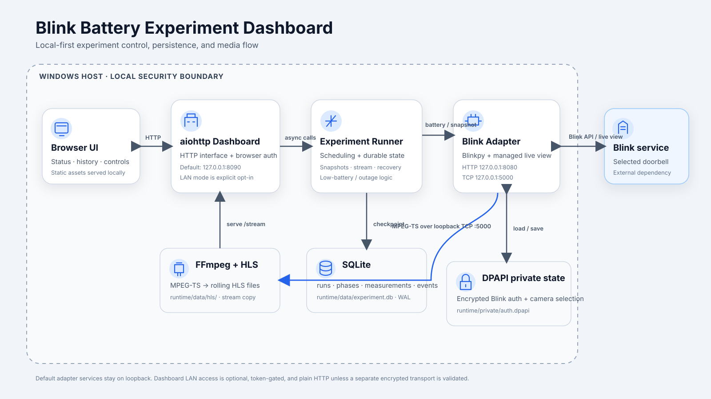
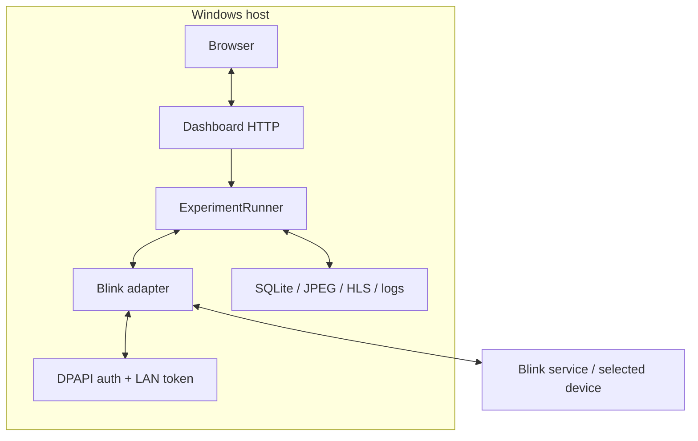

# Architecture

The project is a local Windows-oriented experiment supervisor split into a browser dashboard, an experiment state machine, a loopback Blink adapter, local persistence, and a media path.



## Components

### Browser UI

Static HTML/CSS/JavaScript is served by the aiohttp dashboard. The browser polls status, measurements, and recent errors, renders the latest snapshot or HLS stream, and sends confirmed control requests.

### Dashboard process

`blink_dashboard.__main__` loads configuration, starts the managed adapter process, creates `DashboardApplication`, binds the dashboard HTTP listener, and opens the browser.

The dashboard defaults to `127.0.0.1:8090`. Explicit LAN mode is available only when `server.allow_lan` is true.

### Experiment runner

`ExperimentRunner` owns the durable experiment state machine:

- three scheduled snapshot tests;
- one receipt-confirmed continuous stream test;
- inter-test recovery periods;
- low-battery and fatal-error transitions;
- manual stop/restart/continue controls;
- restart-safe checkpoints.

Network operations are performed outside SQLite transactions.

### Blink adapter

The adapter is a separate process. Its HTTP and TCP services enforce loopback hosts.

- HTTP supplies health, fresh snapshots, and fresh battery readings.
- TCP supplies the live MPEG-TS byte stream consumed by the dashboard-side media pipeline.
- Blinkpy handles account/device operations.
- A pinned, verified `blinkliveview` source revision is loaded only from the managed runtime dependency directory.

The adapter suppresses the upstream library's private live-view target printing.

### Authentication store

Reusable Blink auth state and selected camera identity are serialized into a versioned envelope and encrypted with Windows current-user DPAPI at:

```text
runtime/private/auth.dpapi
```

There is no production plaintext or cross-platform fallback.

### Media path

The local media consumer connects to the adapter's loopback TCP stream and pipes MPEG-TS data into FFmpeg. FFmpeg uses stream copy and writes a rolling HLS playlist/segments under `runtime/data/hls/`.

The dashboard serves that HLS output back to the authorized browser.

### SQLite persistence

`runtime/data/experiment.db` stores runs, phases, measurements, and events in SQLite WAL mode. Schema migrations are versioned in code.

## Trust boundaries



The browser/dashboard boundary is loopback by default. In LAN mode, authorized remote browsers cross the host/network boundary over plain HTTP unless the operator adds and validates a separate encrypted transport.

The adapter boundary never intentionally moves off loopback.

## Default data flow

1. Launcher prepares dependencies and starts the adapter.
2. Adapter authenticates using saved DPAPI state or an interactive prompt.
3. Dashboard waits for adapter readiness and initializes persisted experiment state.
4. Browser reads dashboard status.
5. Snapshot phases request a fresh snapshot through adapter HTTP.
6. Battery polls request fresh Blink data through adapter HTTP.
7. Stream phase causes the media consumer to connect to adapter TCP; the adapter requests live view and emits MPEG-TS.
8. FFmpeg writes HLS files, which the dashboard serves to the browser.
9. Experiment counters/state/events/measurements are checkpointed to SQLite.

## Security-sensitive design choices

- Adapter bind hosts are restricted to loopback in code.
- LAN dashboard access requires explicit configuration and a generated token.
- Query-token authorization is converted to an HTTP-only SameSite cookie.
- Browser control POSTs require JSON and a same-origin `Origin`.
- Auth material is encrypted with DPAPI.
- MFA one-time values are excluded from durable auth payloads.
- Upstream live-view connection targets are not intentionally logged.
- Managed dependency source is pinned by commit and archive SHA-256.

See [SECURITY.md](../SECURITY.md) for operational guidance.
